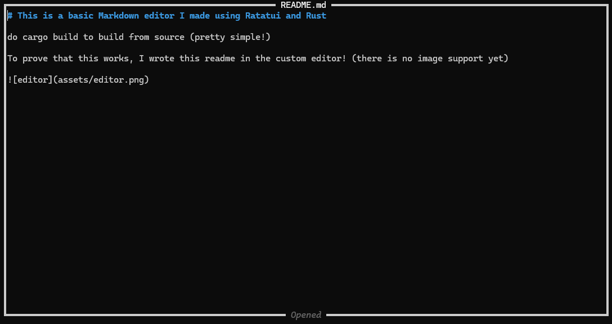

# This is a basic Markdown editor I made using Ratatui and Rust

do cargo build to build from source (pretty simple!)

To prove that this works, I wrote this readme in the custom editor! (there is no image support yet)

